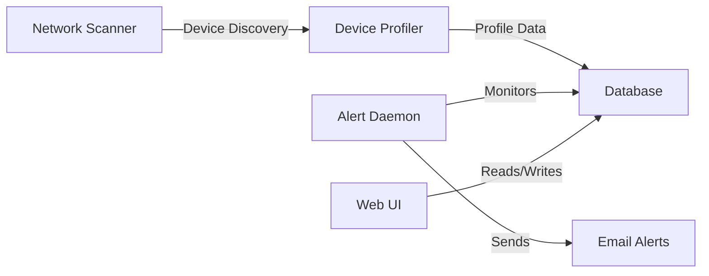

# 📘 NetGuard Technical Documentation
**Version:** 1.3.1  
**Last Updated:** September 4, 2025  
**Author:** Alexander Vasilyev

---

## 🎯 Overview
NetGuard is a comprehensive local network monitoring and security management system built with Python, Flask, and PostgreSQL. This document provides detailed technical information about the system's architecture, components, and configuration options.

---

## 🏗️ System Architecture

### Core Services
1. **Network Monitor Service**
   - Real-time network scanning
   - Device discovery and tracking
   - Connection logging
   - Service: `netguard.service` (Linux) / `NetGuard` (Windows)

2. **Alert Daemon Service**
   - Security event monitoring
   - Email notifications
   - Threat assessment
   - Service: `netguard-alerts.service` (Linux) / `NetGuardAlerts` (Windows)

3. **Web Interface**
   - Real-time dashboard
   - Device management
   - Alert configuration
   - Running on Flask with PostgreSQL

### Data Flow


---

## �️ Installation & Setup

### System Requirements
- **Hardware:**
  - CPU: 2+ cores recommended
  - RAM: 2GB minimum, 4GB recommended
  - Storage: 1GB+ for database and logs
  
- **Software:**
  - Python 3.8 or higher
  - PostgreSQL 13 or higher
  - Git (for installation)
  - SMTP server access
  - Administrator/root access

### Detailed Setup Steps

1. **System Preparation**
   ```bash
   # Linux prerequisites
   sudo apt update
   sudo apt install python3-dev postgresql postgresql-contrib libpq-dev

   # Windows prerequisites
   # Install PostgreSQL from postgresql.org
   # Install Python from python.org
   ```

2. **Application Installation**
   ```bash
   git clone https://github.com/extremealexv/NetGuard.git
   cd NetGuard
   
   # Linux
   chmod +x setup.sh
   ./setup.sh
   
   # Windows
   .\setup.ps1
   ```

3. **Configuration Options**
   The `.env` file supports the following settings:
   ```ini
   # Database Configuration
   DB_NAME=netguard
   DB_USER=postgres
   DB_PASSWORD=your_password
   DB_HOST=localhost
   DB_PORT=5432

   # Email Configuration
   SMTP_SERVER=smtp.example.com
   SMTP_PORT=587
   SMTP_USER=alerts@example.com
   SMTP_PASSWORD=your_smtp_password
   EMAIL_FROM=netguard@example.com
   EMAIL_TO=admin@example.com

   # Flask Configuration
   FLASK_SECRET_KEY=generated_secret_key
   ```

---

## � Component Details

### 1. Network Scanner (`net_scan.py`)
```python
class NetworkScanner:
    def scan_network(self):
        """Performs network scan using ARP"""
    
    def process_device(self, mac, ip):
        """Processes discovered devices"""
```

**Features:**
- ARP-based device discovery
- MAC address validation
- Vendor identification
- Configurable scan intervals
- Low network impact design

### 2. Device Profiler (`device_profiler.py`)
```python
class DeviceProfiler:
    def profile_device(self, mac, ip):
        """Creates comprehensive device profile"""
    
    def get_mac_vendor(self, mac):
        """Queries MAC vendor databases"""
```

**Capabilities:**
- Vendor identification
- OS fingerprinting
- Service detection
- Behavioral analysis
- Profile history tracking

### 3. Alert System (`alert_daemon.py`)
```python
class AlertDaemon:
    def monitor_events(self):
        """Monitors for security events"""
    
    def send_alert(self, event):
        """Sends email notifications"""
```

**Alert Types:**
- New device detection
- Unauthorized access attempts
- Service changes
- Connection patterns
- System status

### 4. Web Interface (`webui/`)
**Core Features:**
- Real-time monitoring
- Device management
- Alert configuration
- Historical data view
- User authentication

**API Endpoints:**
```
GET  /api/devices       - List all devices
POST /api/devices       - Add new device
GET  /api/alerts       - List recent alerts
POST /api/alerts/rules - Configure alert rules
```

---

## 📊 Database Schema

### Tables
1. **devices**
   ```sql
   CREATE TABLE devices (
       id SERIAL PRIMARY KEY,
       mac macaddr NOT NULL,
       hostname VARCHAR(255),
       vendor VARCHAR(255),
       first_seen TIMESTAMP,
       last_seen TIMESTAMP
   );
   ```

2. **connections**
   ```sql
   CREATE TABLE connections (
       id SERIAL PRIMARY KEY,
       device_id INTEGER REFERENCES devices(id),
       ip inet NOT NULL,
       timestamp TIMESTAMP DEFAULT NOW()
   );
   ```

3. **alerts**
   ```sql
   CREATE TABLE alerts (
       id SERIAL PRIMARY KEY,
       type VARCHAR(50),
       message TEXT,
       timestamp TIMESTAMP,
       acknowledged BOOLEAN
   );
   ```

---

## 🔧 Maintenance

### Backup Procedures
1. Database Backup:
   ```bash
   pg_dump netguard > backup.sql
   ```

2. Configuration Backup:
   ```bash
   cp .env .env.backup
   ```

### Log Management
- Location: `/var/log/netguard/` (Linux)
- Rotation: Daily with 30-day retention
- Format: JSON for easy parsing

### Performance Tuning
- Scanner interval: 5-15 minutes recommended
- Database indexes on frequently accessed fields
- Connection pooling for web interface
- Regular vacuum and analyze operations

---

## 🔒 Security Considerations

### Network Security
- Least privilege principle
- Encrypted communications
- Rate limiting on API endpoints
- Regular security updates

### Database Security
- Strong password policies
- Connection encryption
- Regular backups
- Access control

### Access Control
- Role-based authentication
- API key management
- Session timeout settings
- Audit logging

---

## 🔄 Upgrading

### Version Update Process
1. Backup database and configs
2. Pull latest code
3. Run database migrations
4. Update configuration
5. Restart services

### Migration Scripts
Located in `/migrations/` directory:
```sql
-- Example migration
ALTER TABLE devices ADD COLUMN category VARCHAR(50);
```

---

## 🐛 Troubleshooting

### Common Issues
1. **Scanner not detecting devices**
   - Check network interface
   - Verify permissions
   - Review firewall rules

2. **Email alerts not sending**
   - Verify SMTP settings
   - Check network connectivity
   - Review error logs

3. **Database connection issues**
   - Verify credentials
   - Check PostgreSQL service
   - Test network connectivity

### Diagnostic Tools
```bash
# Check service status
sudo systemctl status netguard

# View logs
tail -f /var/log/netguard/netguard.log

# Test database connection
psql -U postgres -d netguard -c "SELECT version();"
```

---

## 📚 Additional Resources

### API Documentation
Full API documentation available at `/docs/api/`

### Contributing Guidelines
See [CONTRIBUTING.md](CONTRIBUTING.md) for development standards

### Support Channels
- GitHub Issues
- Email: support@netguard.local
- Documentation Wiki

---

Made with 🛡️ by Alexander Vasilyev

---

## 🛎️ Alert System

### ⚙️ PostgreSQL Trigger
- **Trigger Function:**
  ```sql
  CREATE TRIGGER new_device_alert
  AFTER INSERT ON new_devices
  FOR EACH ROW
  EXECUTE FUNCTION insert_alert();
  ```
- Automatically creates alerts for new device detection
- Stores alert metadata including device information
- Prevents duplicate alerts via constraint checks

### 🔔 Alert Daemon (`alert_daemon.py`)
- **Notification Channels:**
  - 📧 Email Alerts:
    - SMTP server configuration
    - HTML-formatted device reports
    - Customizable templates
  - 📱 Telegram Integration:
    - Real-time bot notifications
    - Interactive command support
    - Rich message formatting

- **Features:**
  - Asynchronous notification processing
  - Rate limiting to prevent spam
  - Retry mechanism for failed notifications
  - Alert priority levels
  - Customizable notification templates

---

## 💾 Database Schema

### Tables
| Table Name      | Primary Key | Key Fields              | Description                              |
|-----------------|-------------|-------------------------|------------------------------------------|
| `known_devices` | `id`        | `mac_address` (unique)  | Authorized devices with metadata         |
| `new_devices`   | `id`        | `mac_address` (unique)  | Newly discovered devices pending review  |
| `discovery_log` | `id`        | `timestamp, mac_address`| Historical log of all discovered devices |
| `alerts`        | `id`        | `created_at, status`    | Triggered notifications from new devices |

### Key Relationships
- `new_devices` → `known_devices`: Promotion flow
- `discovery_log` → `known_devices`: Device history tracking
- `alerts` → `new_devices`: Alert source tracking

### Indexes
- `idx_mac_address` on all device tables
- `idx_timestamp` on `discovery_log`
- `idx_status` on `alerts`

---

## 🧪 Production Deployment

### Systemd Services
| Service/Timer           | Restart Policy | Dependencies | Description                    |
|------------------------|----------------|--------------|--------------------------------|
| `netguard_web.service` | `on-failure`   | PostgreSQL   | Flask web interface           |
| `netguard_scan.timer`  | N/A            | None         | 30-second scan scheduler      |
| `netureon-alerts.service` | `always`       | PostgreSQL   | Alert notification service    |

### Service Configuration
```ini
[Unit]
Description=NetGuard Web Interface
After=network.target postgresql.service

[Service]
User=netguard
WorkingDirectory=/opt/netguard
ExecStart=/opt/netguard/venv/bin/python webui/app.py
Restart=on-failure

[Install]
WantedBy=multi-user.target
```

---

## 🔐 Configuration

### Environment Variables (`.env`)
```ini
# Database Configuration
DB_NAME=netguard
DB_USER=postgres
DB_PASSWORD=your_secure_password
DB_HOST=localhost
DB_PORT=5432

# Alert Configuration
SMTP_SERVER=smtp.gmail.com
SMTP_PORT=587
SMTP_USER=your_email@gmail.com
SMTP_PASSWORD=your_app_password

# Telegram Configuration
TELEGRAM_BOT_TOKEN=your_bot_token
TELEGRAM_CHAT_ID=your_chat_id

# Web Interface
FLASK_SECRET_KEY=your_random_secret_key
FLASK_HOST=0.0.0.0
FLASK_PORT=5000
```

### Security Considerations
- Use strong passwords and different credentials for production
- Enable SSL/TLS for database connections
- Run services with minimal privileges
- Configure firewall rules for web interface
- Regularly update dependencies for security patches

---

## 📊 Monitoring & Maintenance

### Log Files
- Application logs: `/var/log/netguard/app.log`
- Scanner logs: `/var/log/netguard/scanner.log`
- Alert logs: `/var/log/netguard/alerts.log`
- Web interface logs: `/var/log/netguard/web.log`

### Utility Scripts
1. **Backup Script** (`backup.sh`/`backup.ps1`)
   - Daily database backups
   - Configuration backups
   - 30-day retention policy
   - Automated cleanup
   
2. **Health Check Script** (`health_check.sh`/`health_check.ps1`)
   - Service status monitoring
   - Database connectivity check
   - Web interface accessibility
   - Disk space monitoring
   - Log file management

### Monitoring Tools
1. **System Dashboard**
   - Real-time service status
   - Resource utilization
   - Database statistics
   - Network scanning status

2. **Health Checks**
   - Database connections
   - Service status monitoring
   - Network scanner operation
   - Alert system functionality
   - Web interface availability
   - Resource utilization

3. **Performance Monitoring**
   - Scan completion times
   - Database query performance
   - Web interface response times
   - Alert processing delays

### Backup Strategy
1. Automated Daily Backups:
   ```bash
   # Linux
   ./backup.sh
   
   # Windows
   .\backup.ps1
   ```

2. Manual Backup Commands:
   ```bash
   # Database backup
   pg_dump netguard > /backup/netguard_$(date +%Y%m%d).sql
   
   # Configuration backup
   cp .env /backup/env_$(date +%Y%m%d)
   ```

### Health Check Commands
```bash
# Linux
./health_check.sh

# Windows
.\health_check.ps1

# Manual checks
systemctl status netguard_web
systemctl status alert_daemon
systemctl status netguard_scan.timer
```  
